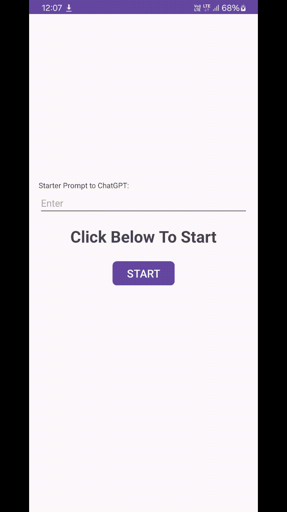

# 📱 SnapQuery

**SnapQuery** is a smart Android utility app that allows users to **select any area of their screen**, extract visible text using **on-device OCR**, and instantly interact with that text — via **ChatGPT**, **Google Search**, or **copy to clipboard** — through a lightweight floating UI overlay.

Designed for productivity and accessibility, SnapQuery runs in the background and provides quick access to contextual information from any screen or app.

---

## 🎬 Demo

![SnapQuery Demo]

## ✨ Features

### 🔍 On-Screen Text Recognition
- Select a region on your mobile screen to detect text visually.
- Uses **Google ML Kit's on-device text recognition** (no internet required).
- Works across all apps and system UI — no root needed.

### 🧠 Instant AI & Web Lookup
- **Send to ChatGPT**: Ask questions or get summaries from extracted text.
- **Search with Google**: Launches a search using the selected content.
- **Copy to Clipboard**: Instantly copy extracted text for reuse.

### 🪟 Floating Overlay Interface
- A persistent, toggleable overlay with floating buttons:
    - 🖼️ **Select area** button to trigger OCR
    - 🤖 **Action mode switch** — choose between ChatGPT / Google / Copy
    - 🌐 **Toggle browser window** — displays results in-app
- Overlay can be accessed from anywhere on screen.
- Custom toast feedback and minimal UI.

### 🔋 Background Operation
- Runs silently in the background via foreground service and notification channel.
- Lightweight performance footprint and optimized for multi-tasking.

---

## 🛠️ Tech Stack

- **Java**
- **Google ML Kit — TextRecognition**
- **WebView for in-app browser**
- **Accessibility & Overlay Permissions**
- **Floating Window & Background Services**